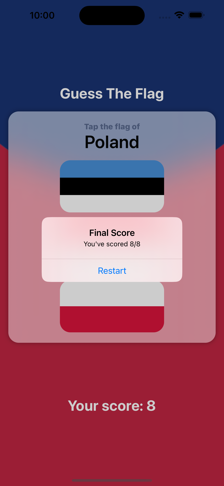

# GuessTheFlag iOS App

GuessTheFlag is an engaging and fun iOS app that tests your knowledge of country flags. It presents you with three random country flags and challenges you to correctly guess the name of the country associated with one of them. The app provides immediate feedback, letting you know if your guess was correct or not. You have a total of 8 attempts to prove your flag knowledge before the final score is displayed in an alert message.

## Screenshots

## Features

- Simple and intuitive user interface.
- Learn and test your knowledge of country flags.
- Immediate feedback with alert messages.
- Eight attempts to improve your score.

## How to Play

1. Launch the app and observe three random country flags.
2. Carefully read the name of the country provided.
3. Tap on the flag that corresponds to the given country name.
4. An alert message will inform you if your guess was correct or incorrect.
5. Continue guessing until you complete all 8 attempts.
6. Your final score will be displayed in an alert message.

## Installation

1. Clone the repository: `git clone https://github.com/roniabusayeed/GuessTheFlag.git`
2. Open the project in Xcode.
3. Build and run the app on your iOS device or simulator.

## Contribution

Contributions are welcome! If you find any issues or have ideas for improvement, feel free to open an issue or submit a pull request.

---

The GuessTheFlag app is an excellent opportunity to test your knowledge of country flags in a fun and interactive way. With its user-friendly interface and immediate feedback, you'll be engaged and challenged to improve your score with each attempt. Download now and start exploring the colorful world of flags! 🏳️🚩
